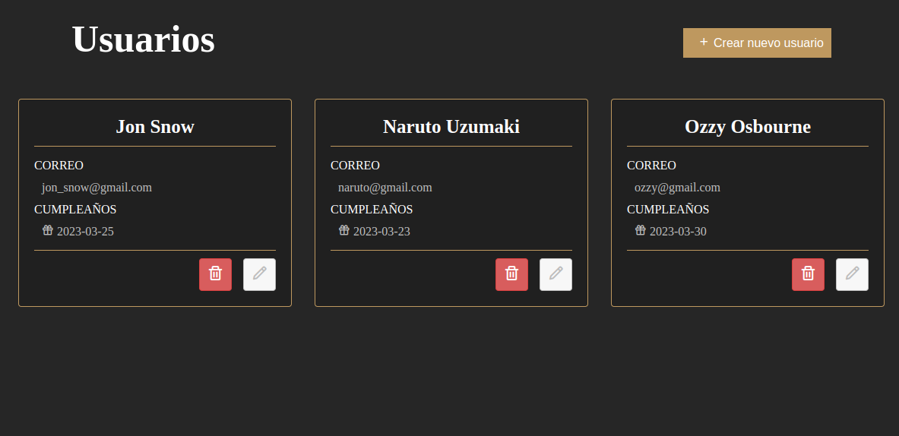

# Full CRUD App

    

 

## Decripcion

Cree una aplicación donde se puedan administrar usuarios a través de un CRUD. Para ello cree mi propia API para consultar, crear, eliminar y actualizar dichos usuarios.

La pagina consiste en listar todos los usuarios, mostrando su nombre, apellido, email y fecha de nacimiento. Adicionalmente cada targeta tiene 2 botones, uno para eliminar. Y uno para editar, el cuál pondrá toda la información del usuario seleccionado en un formulario para ejecutar dicha accion. El formulario tambien sirve para crear un nuevo usuario.

## Funciones y datos del proyecto

- Correcto despliegue de información en cada targeta: nombre, apellido, email y fecha de nacimiento.
- Funcionalidad para eliminar usuarios.
- Funcionalidad para seleccionar un usuario, y asi poder editarlo.
- Funcionalidad para crear usuarios.
- Funcionalidad para actualizar usuarios.
- El formulario esta hecho con “React Hook Form”

## Link

- https://proyect-crud-api.herokuapp.com/api/v1/

## Abrir App

- [CRUD App](https://papaya-malasada-686ac1.netlify.app/)

## Documentacion de la API

- https://documenter.getpostman.com/view/21287351/VUjQo59r

## Lenguajes y Herramientas

- NodeJs
- Express
- PostgreSql
- Postman
- Zequelize
- Heroku
- Swagger
- React
- Axios
- Css
- Framer-Motion
- Redux-Toolkit
- React-Hook-Form
- Html

## Autor

** Diego Nieves **

- [LinkedIn](https://www.linkedin.com/in/diego-nieves-04b409242/)
- [Portafolio web](https://nvs-portfolio.netlify.app)

## Contactame
Si quieres contactarme puedes escribirme a nieves.diego0426@gmail.com 👍.

  

    

